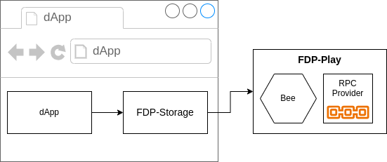
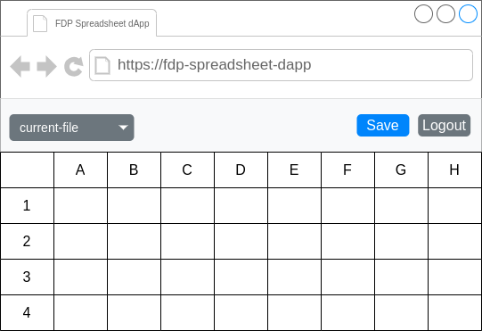

# Getting Started with FDP

In this tutorial we are going to create a decentralized application (dApp) using Fair Data Protocol (FDP) and Swarm.

Before we start, first we are going to get familiar with complete infrastructure that we are going to use for this project.

## Architecture

There are several services and tools that we are going to use for development and deployment of our app. Here, we will get an overview of all of them.

### Swarm

The foundation of every Web3 application is decentralized storage. FDP uses the Swarm network for storing all user's data.

The Swarm network consists of individual Bee nodes interconnected and running by thousands of operators around the world. Data is split into chunks that are distributed among multiple Bee nodes. Chunks can be encrypted and that way accessible only by the uploader.

Node operators are rewarded for storing data on their computers by obtaining BZZ tokens. Because of that, storing data requires providing a Postage Stamp that will be used to pay node operators for storing data.

We could run our own instance of a Bee node and pupurchase a Postage Stamp, but that's not suitable for development. Because it would require spending real money for testing purposes. Instead we will use a local tool that will provide completely the same service only on our local machine without spending any money on buying tokens.

> **Note**: If you want to learn more about the Swarm, this [link](https://docs.ethswarm.org/docs/learn/introduction) would be a great starting point.

### Ethereum RPC Provider

Another important service that we will need is an RPC Provider for Ethereum blockchain. That is a web service that enables us to interact with Ethereum blockchain.

In Web3 world, applications share important data via Smart Contracts. Smart Contracts are programs stored on blockchain. Applications then interact with relevant Smart Contracts by invoking their methods. Those methods can store or retreive information from blockchain.

Because storing data on blockchain is very expensive, a decentralized storage is used instead. Then only references to data are stored in Smart Contracts, while the actual data is stored in decentralized storage, the Swarm in our case.

There are various RPC Providers available on the internet, but again for development, it's best to use our local RPC provider with local blockchain. In that case we don't need to obtain any tokens from others to test our app.

### Fair Data Protocol (FDP)

Now when we defined all external services that are required for our dApp, let's see what is actually the Fair Data Protocol.

The Fair Data Protocol or [FDP](https://fdp.fairdatasociety.org/) is a set of standards defined by [Fair Data Society](https://fairdatasociety.org/). The FDP defines structures and procedures of how data is stored in Swarm. It provides Smart Contracts that all FDP compliant applications use. Developing a FDP application means complying to these standars, so the application can fit into the FDP ecosystem.

Although these standars are abstract and anyone can make tools that implement them, FDS provides variety of tools and libraries that already implement these standards. Developers don't need to spend time learning details about FDP, instead they can focus on developing ther apps just by using powerful tools that are already available.

Let's see some of the core FDP tools that we are going to use for our dApp.

#### FDP-Play

We previously mentioned we needed a Bee node and an RPC Provider for our dApp. The FDP-Play solves both these problems.

FDP-Play is a command-line tool that provides a local Bee node and an RPC provider with a local blockchain. All data created in FDP-Play is stored locally. We don't need to access any remote service or obtain any tokens from other networks.

One more important feature of FDP-Play is that it already contains all FDP Smart Contracts. That means it completely porvides all services required by a FDP application.

#### FDP-Storage

Technically, at this point we could start developing our dApp as FDP-Play provides all required infrastructure. But implementing access to these services on a low-level would require a lot of time and effort.

For that reason we are going to use the [FDP-Storage](https://github.com/fairDataSociety/fdp-storage) JavaScript library. This library already implements all FDP protocols for storing data on Swarm and interaction with FDP Smart Contracts. It provides simple and intuitive interface by abstracting all low-level operations.

### Architecture Summary

Now we are ready to start working on our dApp. As a summary of this section here is a diagram of all the services and components we discussed so far and how they interact to each other.



Our dApp will be a web application running inside the browser. It will include the FDP-Storage library which will interact with the services of FDP-Play.

## dApp Overview

The application we are going to develop is a dApp for editing Spreadsheets. The main page should look like this:



It is going to be executed inside the browser and enable users to create and edit Spreadsheet files. Files will be stored in the Swarm network and only the user who is logged in will be able to access them. For simplicity we are going to store files in the `JSON` format, although we could technically convert them to the `XLS`. But that would introduce unnecessary complexity for this tutorial.

We are going to develop and test this dApp completely locally first. When we test it and we are sure that it works correctly, then we are going to deploy it to the internet. At that point we will start to use real networks, so other users can use it too.

### dApp Architecture

For this dApp we are going to use [React](https://react.dev/learn), [Bootstrap](https://getbootstrap.com/), [Typescript](https://www.typescriptlang.org/) and [Vite](https://vitejs.dev/). If you are not familiar with these technologies, don't worry. They are not required for understanding FDP tools.

### Requirements

You need to have installed [NodeJS](https://nodejs.org/) version 18 or higher, NPM and [Docker](https://www.docker.com/).

## Project Setup

In this section we are going to generate our project and setup required services.

### Installing FDP-Play

Before creating our project we need [FDP-Play](https://github.com/fairDataSociety/fdp-play) installed and running. In order to run `FDP-Play` you must have [Docker](https://www.docker.com) installed.

> **Note**: If you don't have Docker installed check [this link](https://www.docker.com/get-started/) to see installation instructions for your operating system.

To install `FDP-Play` run the following command in your terminal:

```bash
npm install -g @fairdatasociety/fdp-play
```

Now `FDP-Play` can be accessed by typing `fdp-play` in your console. To see available commands run:

```bash
fdp-play --help
```

To start all services that we are going to use in our dApp, run:

```bash
fdp-play start
```

> **Note**: If you are getting an `EACCES` error when running `FDP-Play`, that means that the current OS user is not added to the docker group. To fix it, run the following commands: `sudo usermod -aG docker $USER` and then `newgrp docker`

If started successfully you should see logs in the console.

All our services are now ready, but in order to upload data to our Bee node we still need to provide a Postage Stamp. Even if our Bee node is used just for testing, it still functions in the same way as a real Bee node.

Creating a Postage Stamp requires sending a POST request to debug API, exposed by Bee nodes only locally. The debug API is available on port `1635` by default. That request can be sent with application like Postman. But it's easier doing that from console with `curl`:

```bash
curl -s -XPOST http://localhost:1635/stamps/10000000/18
```

The response should look similar to this:

```json
{
  "batchID": "5e4bfd57e22fe9bf4dda8bb2a36d81419224900dabac2b06113e745b59b5bed9",
  "txHash": "0x0a50002312ad26f123d3e4e1d4a65fcb676e1131d196e119ed7892112b59e70f"
}
```

Save the value of the `batchID` property, because that's the ID of our Postage Stamp that we are going to use by our dApp.

> **Note**: To learn more about how Postage Stamps work, check [this link](https://docs.ethswarm.org/docs/learn/technology/contracts/postage-stamp).

### Creating the project

Open your terminal and navigate to directory where you are going to create your project. Don't create a directory for the project, just navigate to the path where it should be located. Then run the following command:

```bash
npm create vite@^5.2.0
```

This command will install [Vite](https://vitejs.dev/guide/) and ask for project configuration.

Enter any project name you want. In this tutorial we will call it `fdp-spreadsheet-dapp`.

For the framework select `React`. And for variant select `Typescript`.

Change the current directory to your new project directory created by Vite. Then install all project dependencies by running:

```bash
npm install
```

Now we are going to install all packages that we are going to use in our dApp. We need the following libraries:

- [`@fairdatasociety/fdp-storage`](https://github.com/fairDataSociety/fdp-storage) - As we mentioned earlier, we are going to use the `FDP-Storage` to interact with services and to use FDP protocols.
- [`bootstrap`](https://getbootstrap.com/) and [`react-bootstrap`](https://react-bootstrap.github.io/) - It's not relevant for this tutorial, we are using it just to make our app prettier. We will not focus too much on usage of Bootstrap in this tutorial.
- [`scheduler`](https://www.npmjs.com/package/scheduler) and [`react-spreadsheet`](https://www.npmjs.com/package/react-spreadsheet) - These libraries are used for providing components to work with spreadsheets.

To ensure that everything is working as intended, specific versions are specified in installation process.

```bash
npm install --save @fairdatasociety/fdp-storage bootstrap@^5.3.3 react-bootstrap@^2.10.2 scheduler@^0.23.0 react-spreadsheet@^0.9.4
```

We will need some libraries for development only, so these will be dev dependencies:

- [`vite-node`](https://www.npmjs.com/package/vite-node) - We will use this library just to run a Typescript file with node
- [`sass`](https://www.npmjs.com/package/sass) - A processor for SCSS files. To learn more about SCSS check this [page](https://sass-lang.com/documentation/syntax/)
- [`ethers`](https://docs.ethers.org/v6/) - EthersJS is a most popular library for interaction with RPC Blockchain Providers. We won't use this library in our dApp directly, but we need it for a testing scripts.

```bash
npm install --save-dev vite-node@^1.5.0 sass@^1.75.0 ethers@^6.12.0
```

Finally, run the local development server:

```bash
npm run dev
```

And open this URL in your browser: [`http://localhost:5173/`](http://localhost:5173/)

You should see a demo application.

Now we are ready to start writing some code. Open the new project directory in your code editor.

## Creating FDS Account

As we discussed in the dApp overview section, we want every user to be able to access only their own data. So no one else can access files that our user created. To achieve that the user that is using our dApp must encrypt files.

In FDP-Storage that can be achieved in two ways. One is by providing a private key directly to the library, in other words providing a wallet. The issue with this approach is that the user will have to provide their private key each time when accessing our dApp. Because private keys are too difficult to remember, it must be copy/pasted by the user each time when the user logs in. That is not convenient and it is a security risk.

That's why we are going to use the other way which is FDP Ethereum Name Service (ENS).

### FDP Ethereum Name Service

FDP provides an Ethereum Name Service (ENS) Smart Contract that stores users' private keys. Private key is encrypted by a password that the user chooses. A powerful encryption is applied, so only way to decrypt the private key is to apply decrpytion algorithm using the same password.

Creating an FDS ENS account requires a unique username that will be associated with the encrypted private key. Because account information is stored in the ENS Smart Contract, it requires a transaction to be made when a new user gets registered. That means the user needs to have enough funds in their Ethereum address associated with that private key.

There is a FDS web application that is used to easily create an FDS account. But we will check that application later. For now we are going to create a script that will create an account in `FDP-Play` that we can use for testing.

### Create Account Script

We will create a utility script that we are going to use to create accounts in our `FDP-Play` environment. We will run the script with NodeJS and it won't be a part of our web application. We will use this script only for testing our dApp locally.

Create a new directory in the root of your project and name it `scripts`. Inside, create a file named `create-account.ts`. We will execute this script whenever we want to create a new user in our `FDP-Play`.

It will require three parameters, a username, a password and a Postage Stamp ID. Because registering a new user requires writing data to Swarm, we need the Batch ID property that we saved before.

Let's start writing our code by importing classes and functions that we will use inside our script.

```Typescript
import { JsonRpcProvider, Wallet, parseEther } from "ethers";
import { FdpStorage } from "@fairdatasociety/fdp-storage";
```

With the `JsonRpcProvider` class from [ethers](https://docs.ethers.org/) we can make our own transactions on a custom RPC. We need that in order to send some coins to our new user's wallet. In `FDP-Play` there are addresses that are prefunded with large amount of coins, so we will use one such address to send some amount to our new address. The `parseEther` function is used only to convert string coin values into proper type.

The Wallet class represents a public and private key pair. We will generate a new wallet for our new account.

From the `FDP-Storage` library we import the `FdpStorage` class that is the main class used to interact with FDP services.

Now let's define a function that will do all tasks necessary for registering an FDP account. It needs to accept the following parameters:

- `username` and `password` for the new account.
- `postageStampId` that we need for storing data to Swarm.
- `rpcUrl` which is a URL of our RPC provider.
- `beeUrl` a URL of a Bee node that we will use for storing data.
- `fundingPrivateKey` is a private key of an address that has enough coins, so we can transfer from it to our newly created address.

```Typescript
async function createAccount(
username: string,
password: string,
postageStampId: string,
rpcUrl: string,
beeUrl: string,
fundingPrivateKey: string
) { }
```

First we are going to generate a new wallet for our account using `FDP-Storage`. We do so by creating an instance of the `FdpStorage` class. That class must be configured with Bee URL that we are going to use and with a valid Postage Stamp ID. Then we use the `account` service available on the instance of the class to generate a new wallet.

```Typescript
const fdp = new FdpStorage(
  beeUrl,
  postageStampId as any
);
const accountWallet = fdp.account.createWallet();
```

Now we have a new wallet for our user, but before registering it to ENS we need to make sure we have enough coins in that address. So the next step is to transfer some funds from our funding address to our account address.

To do so, we need an instance of the `JsonRpcProvider` class. Then we create a wallet for our funding private key, so we can send 0.1 ETH to user's addrees. That amount is enough for paying all transactions required by registration process. We pass our provider instance to the funding Wallet, so the funding wallet can send transactions.

```Typescript
const provider = new JsonRpcProvider(rpcUrl);

const fundingWallet = new Wallet(fundingPrivateKey, provider);

const tx = await fundingWallet.sendTransaction({
  to: accountWallet.address,
  value: parseEther("0.1"),
});

await tx.wait();
```

We wait for transaction to complete to be sure we can proceed with the next step. And the next step is registering our new address to FDS ENS. That will store the user's private key of the `accountWallet` that we generated at the begining of our function. That private key will be encrypted with the password that is provided to the function.

Because registration requires multiple transactions and steps that can't be repeated, registration is split into two actions. First we need to create an object that will represent a registration request. Then we pass that object to the `register` function. By using this object, we can safely repeat registration if it fails. Because the object will contain information about progress of registration and exact step where it failed. But in our case, because this code will be used just locally, we won't implement any erorr handling.

```Typescript
const registrationRequest = fdp.account.createRegistrationRequest(
    username,
    password
);

await fdp.account.register(registrationRequest);
```

The function is now complete. We just need to parse command line parameters and call our function.

We expect to receive 5 parameters from the command line. One is for node, the second for the file name, and three more for our parameters. Write the following code bellow the previous function:

```Typescript
if (process.argv.length < 5) {
  throw new Error(
    "Usage: vite-node create-account.ts <username> <password> <postage_stamp_id>"
  );
}

const username = process.argv[2];
const password = process.argv[3];
const postageStampId = process.argv[4];
```

The last step is to invoke our function. Because in older versions of NodeJS we can't use await outside of functions, we add a `then` and a `catch` function. That will keep our program running until it finishes.

For the first three parameters we just pass values that we received from command line. The fourth parameter is the URL of `FDP-Play` RPC provider which by default is listening on port `9545`. A Bee node in `FDP-Play` is listening on port `1633`. And the last parameter is the private key of the prefunded address. In `FDP-Play` this address contains large amount of coins we can use to transfer to other addresses.

```Typescript
createAccount(
  username,
  password,
  postageStampId,
  "http://localhost:9545",
  "http://localhost:1633",
  "0x4f3edf983ac636a65a842ce7c78d9aa706d3b113bce9c46f30d7d21715b23b1d"
)
  .then(() => console.log("Account created"))
  .catch(console.error);
```

Before we test our script, let's add a command to the `scripts` section in our `package.json` file, so we can execute it easier:

```json
"scripts": {
  ...
  "create-account": "vite-node scripts/create-account.ts"
}
```

Finally let's create our first FDP user. Just provide your `BatchID` value insted the one in the command:

```bash
npm run create-account test-user password 5e4bfd57e22fe9bf4dda8bb2a36d81419224900dabac2b06113e745b59b5bed9
```

The output should be `Account created`. Congratulations, we created our first FDP account.

## Project Preparations

Before we start writing our React components we need to make a few changes to the generated files.

We are going to use SCSS for our styles, so let's rename our `src/App.css` file to `src/App.scss`. We will delete all generated code inside that file and import Bootstrap styling by adding this line:

```scss
@import "bootstrap/scss/bootstrap";
```

Since we are going to use Bootstrap, we don't need any predefined stylings, so we can clear all content from the `src/index.css` file as well.

The `src/App.tsx` file needs some changes as well. Since we changed the name of our file containing stylings, we need to update the import in the `App.tsx` file. We will delete all imported assets and clear the body of the `App` component. The file will look like this:

```Typescript
import { useState } from "react";
import "./App.scss";

function App() {
  return <></>;
}

export default App;
```

One more step, let's change app title in the `index.html` file:

```html
<title>FDP Spreadsheet dApp</title>
```

## Login Page

Now is the time to start writing our dApp. We will start by creating our Login component. We will keep the app simple, so we won't use router for switching views. Instead if the user is not logged in, we will show the Login page, otherwise we will show app content instead.

The login page will be a simple form that expects a username and a password to be submitted. On submit we will create an instance of the `FDPStorage` class and use it to log in to ENS. The login process will load encrypted private key from ENS and use the provided password to decrypt it locally. Then we will be able to access our encrypted files.

Let's define our imports and our component. Create a new directory `components` in the `src` directory and a new file inside `Login.tsx`.

The initial content of the file will be:

```Typescript
import { useState, FormEvent } from "react";
import { FdpStorage, FdpContracts } from "@fairdatasociety/fdp-storage";
import Button from "react-bootstrap/Button";
import Modal from "react-bootstrap/Modal";
import Form from "react-bootstrap/Form";
import InputGroup from "react-bootstrap/InputGroup";
import Alert from "react-bootstrap/Alert";

interface LoginProps {
  onLogin: (fdp: FdpStorage) => void;
}

function Login({ onLogin }: LoginProps) {
}

export default Login;
```

We import the `useState` and an event class for React. Additional class from `FDP-Storage` called `FdpContracts` which we will see what it means later. And some Bootstrap components for our view.

The component will accept only one prop which is a function that is triggered after successful log in. It will pass an instance of `FdpStorage` that contains private key of logged in user. That instance then will be used to access files from that user.

We will write our Login component first without actual handlers, just to analyze what's going on inside:

```Typescript
function Login({ onLogin }: LoginProps) {
  const [username, setUsername] = useState("");
  const [password, setPassword] = useState("");
  const [validated, setValidated] = useState(false);
  const [loading, setLoading] = useState(false);
  const [error, setError] = useState(false);

  const onSubmit = async (event: FormEvent) => {
  }

  return (
    <div
      className="modal show"
      style={{ display: "block", position: "initial" }}
    >
      <Modal.Dialog>
        <Form noValidate validated={validated} onSubmit={onSubmit}>
          <Modal.Header>
            <Modal.Title>FDS Login</Modal.Title>
          </Modal.Header>

          <Modal.Body>
            <p>Please log in using your FDS username and password.</p>

            <Form.Group className="mb-3" controlId="username">
              <Form.Label>Username</Form.Label>
              <InputGroup hasValidation>
                <Form.Control
                  type="text"
                  placeholder="Username"
                  value={username}
                  onChange={(event) => setUsername(event.target.value)}
                  disabled={loading}
                  required
                />
                <Form.Control.Feedback type="invalid">
                  Please enter a username.
                </Form.Control.Feedback>
              </InputGroup>
            </Form.Group>

            <Form.Group className="mb-3" controlId="password">
              <Form.Label>Password</Form.Label>
              <InputGroup hasValidation>
                <Form.Control
                  type="password"
                  placeholder="Password"
                  value={password}
                  onChange={(event) => setPassword(event.target.value)}
                  disabled={loading}
                  required
                />
                <Form.Control.Feedback type="invalid">
                  Please enter your password.
                </Form.Control.Feedback>
              </InputGroup>
            </Form.Group>
          </Modal.Body>

          <Modal.Footer>
            {error && (
              <Alert variant="danger">
                Couldn't log in. Check your username and password.
              </Alert>
            )}
            <Button disabled={loading} variant="primary" type="submit">
              Submit
            </Button>
          </Modal.Footer>
        </Form>
      </Modal.Dialog>
    </div>
  );
}
```

We will not spend much time going into details of Bootstrap. We will just briefly go through the JSX code.

The whole form is wrapped in a `Modal.Dialog` component just for visual purposes, but the component will be always visible while the Login component is rendered. All our inputs are inside the `Form` component which will invoke the `onSubmit` function when submitted. The `validated` property is just used to make the form display errors only after it gets submitted for the first time. We don't want to frighten our users by displaying errors before they even typed anything. The `noValidate` property just disables default HTML validation.

The form has two input fields that uses state variables to store their values, the `username` and `password`.

We use three additional state variables to provide a bit better user experience. As we mentioned the `validation` variable is just an indicator to Bootstrap Form that the form has been submitted, so it can display validation errors. The `loading` variable is set to `true` while we are waiting for response, to disable the form. That will prevent user from submitting the form multiple times. And the `error` variable is just used to show error in case if request failed.

The real logic is inside the `onSubmit` method. So let's write it now.

We will wrap all code in a `try/catch` block. So if it fails for any reason we can set the `error` flag to `true` and display an error message. Also we will switch the `loading` flag to `true` at the begining and to `false` at the end of the function. We also need to prevent default behaviour of the form because we don't want the browser to handle the submit event. And we need to confirm that the user really entered `username` and `password`.

```Typescript
const onSubmit = async (event: FormEvent) => {
  try {
    event.preventDefault();

    setValidated(true);
    setError(false);
    setLoading(true);

    if (!username || !password) {
      return;
    }

  } catch (error) {
    console.error(error);
    setError(true);
  } finally {
    setLoading(false);
  }
};
```

Before logging in the user, we need to create an instance of the `FdpStorage` class. We saw how to do that when we wrote our function for creating an account. We hardcoded parameters there. But because this is a web application that will be running not only in our local environment, but also in a web server, we need to make those parameters configurable. We do so by creating the `.env` file in the root directory of our project. Let's create that file and set these variables there:

```
VITE_BEE_NODE_URL=http://localhost:1633
VITE_POSTAGE_STAMP_ID=5e4bfd57e22fe9bf4dda8bb2a36d81419224900dabac2b06113e745b59b5bed9
```

Don't forget to replace the Stamp ID with your value. These variables will be loaded by Vite and will become available in our code by accessing the `import.meta.env` object. Now we can create an instance of `FdpStorage` with parameters that we define in this file.

```Typescript
const fdp = new FdpStorage(
  import.meta.env.VITE_BEE_NODE_URL,
  import.meta.env.VITE_POSTAGE_STAMP_ID
)
```

This will handle Bee address and Postage Stamp, but what about the RPC Provider? Remember when we created an account we used the `http://localhost:9545` URL for RPC provider to transfer coins for our account address. But we didn't specify any RPC URL for the `FdpStorage` instance. That worked there because by default the `FdpStorage` will use that RPC if not specified. But in production environment we certainly can't use that URL. Because of that `FdpStorage` accepts a third optional parameter which can configure RPC provider.

Providing just URL of an RPC provider is easy, but that's not enough. Remember we mentioned that FDS has their Smart Contracts already deployed to the `FDP-Play` which are mandatory for FDP apps. Every Smart Contract has its own address, but those adresses are different in other networks. That means when changing blockchain network, we need to change contract addresses and RPC Provider URL. But how do we know what are the addresses? Actually we don't need to know. The `FDPStorage` already has all predefined configuration for all networks that it supports. So we just need to choose which network we want to use and it will initialize with appropriate RPC URL and contract addresses.

For that reason we imported the `FdpContracts` object. It contains configurations for different networks. We just need to choose which network we want to use in our app. Because we will run our app in local environment for development and later when we deploy our app we will use the `Sepolia` network, we then choose environment depending in which mode our app is running.

```Typescript
const env = import.meta.env.PROD
  ? FdpContracts.Environments.SEPOLIA
  : FdpContracts.Environments.LOCALHOST;
```

When we build our dApp for production, the `PROD` environment variable will be set to `true` which means we use `Sepolia` in that case. Otherwise we use `FDP-Play` configuration. Then we use this `env` object to initialize the `FdpStorage` instance properly:

```Typescript
const fdp = new FdpStorage(
  import.meta.env.VITE_BEE_NODE_URL,
  import.meta.env.VITE_POSTAGE_STAMP_ID,
  {
    ensOptions: FdpContracts.getEnsEnvironmentConfig(env),
    dataHubOptions: FdpContracts.getDataHubEnvironmentConfig(env)
  }
);
```

The `getEnsEnvironmentConfig` function is just a utility function that returns ENS configuration object for given environment. Because there are two separate groups of Smart Contracts that are used by `FdpStorage` they can be configured sparately. That's why we need to configure the Data Hub contracts although we won't use them in this tutorial. For that we use the `getDataHubEnvironmentConfig` function.

With all this configuration done we now can log in our user just by calling the `login` function and providing user's username and password. The rest of the `onSubmit` function will look like this:

```Typescript
const env = import.meta.env.PROD
  ? FdpContracts.Environments.SEPOLIA
  : FdpContracts.Environments.LOCALHOST;

const fdp = new FdpStorage(
  import.meta.env.VITE_BEE_NODE_URL,
  import.meta.env.VITE_POSTAGE_STAMP_ID,
  {
    ensOptions: FdpContracts.getEnsEnvironmentConfig(env),
    dataHubOptions: FdpContracts.getDataHubEnvironmentConfig(env)
  }
);

await fdp.account.login(username, password);

onLogin(fdp);
```

After successfully logging in we pass the configured `FdpStorage` object to parent component.

Our Login component is done, we just need to render it in our `App` component. We need to update our `src/App.tsx` file to display the Login component when user is not logged in. We will know whether the user is logged in by saving the `FdpStorage` instance in a state variable.

```Typescript
import { useState } from "react";
import "./App.scss";
import { FdpStorage } from "@fairdatasociety/fdp-storage";
import Login from "./components/Login";

function App() {
  const [fdp, setFdp] = useState<FdpStorage | null>(null);
  return (
    <div>
      {fdp ? (
        "User is logged in"
      ) : (
        <Login onLogin={setFdp} />
      )}
    </div>
  );
}

export default App;

```

Let's now test the Login component. Open the `http://localhost:5173/` URL in your browser. Type the userame and password that you used to create an account and click the "Submit" button. You should see the `User is logged in` message in the page. Great that means we can successfully log in. Now let's write our Editor component.

## Editor page

The Editor component will be the place where we display a spreadsheet along with options in the header. First we are going to create an empty component and wire it inside our `App` component. Create a new file in `src/components` called `Editor.tsx` and write:

```Typescript
import { useEffect, useRef, useState } from "react";
import { FdpStorage } from "@fairdatasociety/fdp-storage";

export interface EditorProps {
  fdp: FdpStorage;
  onLogout: () => void;
}

function Editor({ fdp, onLogout }: EditorProps) {
  return null
}

export default Editor;
```

And change the `App.tsx` component by importing the `Editor` component and displaying it instead of showing a message.

```Typescript
...
import Editor from "./components/Editor";

...

{fdp ? (
  <Editor fdp={fdp} onLogout={() => setFdp(null)} />
) : (
  <Login onLogin={setFdp} />
)}
```

The Editor component will receive the `FdpStorage` object that we created in the `Login` component and use it to interact with user's files. Also we will provide a log out button, so we need to remove the object on that event.

### Header component

All options will be inside the Header component. There we will have a dropdown menu which will list all saved files by our dApp. From that dropdown, the user will be able to select a file and content of that file will be loaded and displayed in the spreadsheet.

We will have a Save button which will prompt user for file name and save the current state of the spreadsheet into that file. And there will be a Logout button as well.

Let's start from the easiest component first, the `FileSelect`. That's just a dropdown component that will enable user to select a file from a list of files. Create a new file in the `src/components` directory called `FileSelect.tsx` and write the following code:

```Typescript
import Dropdown from "react-bootstrap/Dropdown";
import DropdownButton from "react-bootstrap/DropdownButton";

interface FileSelectProps {
  className: string;
  currentFileName: string;
  fileNames: string[];
  onSelect: (fileName: string) => void;
}

function FileSelect({
  className,
  currentFileName,
  fileNames,
  onSelect,
}: FileSelectProps) {
  return (
    <DropdownButton className={className} title={currentFileName || "---"}>
      {fileNames.map((fileName) => (
        <Dropdown.Item key={fileName} onClick={() => onSelect(fileName)}>
          {fileName}
        </Dropdown.Item>
      ))}
    </DropdownButton>
  );
}

export default FileSelect;
```

It is just a simple Bootstrap component which will display currently opened file name if available. If the user selects another file we will get notified by the `onSelect` prop.

Now let's create a component that we will use when user wants to save current state to a file. This component will contain a button that will be displayed in the Header. And also a modal dialog that will pop up when the button is clicked. That modal will display a form in which user needs to enter file name. If some file is already selected, than that name will be prepopulated.

Create the `SaveFile.tsx` in the `src/components` and write the following code:

```Typescript
import { useState, FormEvent } from "react";
import Modal from "react-bootstrap/Modal";
import Form from "react-bootstrap/Form";
import Button from "react-bootstrap/Button";

interface SaveFileProps {
  currentFileName: string;
  onSave: (fileName: string) => void;
}

function SaveFile({ currentFileName, onSave }: SaveFileProps) {
  const [modalOpen, setModalOpen] = useState(false);
  const [fileName, setFileName] = useState(currentFileName);

  const onOpenModal = () => {
    setFileName(currentFileName);
    setModalOpen(true);
  };

  const onSubmit = (event: FormEvent) => {
    event.preventDefault();

    if (!fileName) {
      return;
    }

    setModalOpen(false);
    onSave(fileName);
  };

  return (
    <>
      <Button variant="primary" onClick={onOpenModal}>
        Save
      </Button>

      <Modal show={modalOpen} onHide={() => setModalOpen(false)}>
        <Form noValidate onSubmit={onSubmit}>
          <Modal.Header closeButton>
            <Modal.Title>Save File</Modal.Title>
          </Modal.Header>
          <Modal.Body>
            <Form.Group className="mb-3" controlId="filename">
              <Form.Label>Please enter a file name:</Form.Label>
              <Form.Control
                type="text"
                placeholder="File name"
                value={fileName}
                onChange={(event) => setFileName(event.target.value)}
                required
              />
            </Form.Group>
          </Modal.Body>
          <Modal.Footer>
            <Button variant="secondary" onClick={() => setModalOpen(false)}>
              Close
            </Button>
            <Button variant="primary" type="submit">
              Save Changes
            </Button>
          </Modal.Footer>
        </Form>
      </Modal>
    </>
  );
}

export default SaveFile;
```

The component accepts two props. One is the currently opened file name and the second is a callback which is invoked when we get confirmation from the user to save file.

For that we need two state variables. One will indicate whether the modal is open or not. And the other will contain text that the user is typing into the input field inside the modal.

When opening the modal with the `onOpenModal` function we also reset text to the current file name. That function is called when the user clicks on the Save button.

At that moment the modal will be shown and we will hold the input value inside the `fileName` variable. So when the user submits the form our `onSubmit` function will be invoked. Inside there we just prevent default behaviour of the event as before. We then check if we have a valid file name and if so we close the modal and notify our parent component with the file name.

After creating these components, writing the Header component will be straightforward. The Header component will just render these components along with the Logout button and wire all events back to the parent, the Editor component. We will create the `Header.tsx` file inside `src/components` and write it:

```Typescript
import Container from "react-bootstrap/Container";
import Navbar from "react-bootstrap/Navbar";
import Button from "react-bootstrap/Button";
import ButtonGroup from "react-bootstrap/ButtonGroup";
import FileSelect from "./FileSelect";
import SaveFile from "./SaveFile";

interface HeaderProps {
  currentFileName: string;
  fileNames: string[];
  onSelect: (fileName: string) => void;
  onSave: (fileName: string) => void;
  onLogout: () => void;
}

function Header({
  currentFileName,
  fileNames,
  onSelect,
  onSave,
  onLogout,
}: HeaderProps) {
  return (
    <Navbar className="bg-body-secondary" sticky="top">
      <Container>
        <FileSelect
          currentFileName={currentFileName}
          fileNames={fileNames}
          onSelect={onSelect}
          className={fileNames.length > 0 ? "visible" : "invisible"}
        />
        <ButtonGroup>
          <SaveFile currentFileName={currentFileName} onSave={onSave} />
          <Button variant="secondary" onClick={onLogout}>
            Logout
          </Button>
        </ButtonGroup>
      </Container>
    </Navbar>
  );
}

export default Header;
```

We will receive currently opened file from the Editor and a list of already saved file names. We pass these props to our child components along with event callbacks. The `onSelect` is called when the user selects a file from the `FileSelect` component. The `onSave` is called when the user confirms file name in the `SaveFile` component. And the `onLogout` is called when the Logout button is clicked.

One note regarding the `FileSelect` component. We don't want to show this component if there are no saved files. That's why we check if `fileNames.length` is 0 and we hide the entire component in that case. We could use `display: none` instead, but that would change the layout of the components. That's way the component will just become visible if a file name is added.

We can now add the Header to the Editor component. The updated Editor component will look like this:

```Typescript
...
import Header from "./Header";

...

function Editor({ fdp, onLogout }: EditorProps) {
  const [existingFiles, setExistingFiles] = useState<string[]>([]);
  const [editedFile, setEditedFile] = useState<string>("");

  const onLoadFile = async (fileName: string) => { }

  const onSave = async (fileName: string) => { }

  return (
    <div>
      <Header
        currentFileName={editedFile}
        fileNames={existingFiles}
        onSelect={onLoadFile}
        onSave={onSave}
        onLogout={onLogout}
      />
    </div>
  )
}
```

We also defined state variables for list of existing file names - `existingFiles`. And the currently edited file name - `editedFile`.

If you open the page again and log in if needed, you will see the header along with the 'Save' and 'Logout' buttons.

Now we can focus on the main part, the Editor.

### Editor component

All our FDP logic will be inside this component. Before allowing the user to interact with this component we need to load some data. We need to fetch list of alredy saved files by our dApp and provide them to our Header component.

To prevent user from interacting with our dApp while requests are being processed we will add the `loading` state variable. It will indicate whether we are waiting for some operation to complete. If that's the case we will show a loading spinner above our whole page preventing user for accidentally making other requests.

We will add the state variable and a modal component bellow our Header:

```Typescript
...
import Modal from "react-bootstrap/Modal";
import Spinner from "react-bootstrap/Spinner";

...
function Editor({ fdp, onLogout }: EditorProps) {
  ...
  const [loading, setLoading] = useState(false);
  ...

  return (
    <div>
      <Header
        currentFileName={editedFile}
        fileNames={existingFiles}
        onSelect={onLoadFile}
        onSave={onSave}
        onLogout={onLogout}
      />
      <Modal show={loading} className="loading-modal">
        <Spinner animation="border" className="m-auto" />
      </Modal>
    </div>
  )
}
```

In order for the modal to be displayed correctly we need additional SCSS. Add the following SCSS code to the `src/App.scss` file:

```SCSS
.loading-modal {
  height: 100%;
  .modal-dialog {
    height: 100%;
    margin: 0;
    margin: auto;
    .modal-content {
      margin: auto;
      height: 100%;
      background: transparent;
      border: none;
    }
  }
}
```

This component will just display a transparent backgroud over the whole page along with a spinner.

When the Editor component loads for the first time, we need to fetch existing user's file names. We do so in React by using the `useEffect` hook. Because the function passed to `useEffect` cannot be async we will define the `loadExistingFiles` function that will be invoked from the `useEffect`.

But how do we fetch user's files? In FDP, user's files are organized in pods. Pods are like drives in the terminology of operating systems. Each pod has its own file system, which means it contains a hierarchy of directories and files. But when a new user is registered there are no pods, so pods must be created before interacting with them.

In our dApp we could use any pod for storing and retrieving files, but it's more convenient to use only one pod that is dedicated to our dApp. That way we can expect the dApp's pod will contain only files relevant to our dApp. This means that before trying to load files we need to check wheather our pod exists. If doesn't we can't load files then.

There is no convention for pod names, but better to make sure we use a name that will most likely be available. So we will add these changes to our Editor component:

```Typescript
...
const APP_POD_NAME = "fdp-spreadsheet-dapp-pod";

function Editor({ fdp, onLogout }: EditorProps) {
  ...
  const [appPodExists, setAppPodExists] = useState(false);

  const checkAppPod = async (): Promise<boolean> => {
    const podList = await fdp.personalStorage.list();
    return podList.pods.some((pod) => pod.name === APP_POD_NAME);
  };

  const loadExistingFiles = async () => {
    try {
      setLoading(true);

      const appPodExists = await checkAppPod();
      setAppPodExists(appPodExists);

      if (!appPodExists) {
        return;
      }

      const podContent = await fdp.directory.read(APP_POD_NAME, "/");
      const existedFiles = podContent.files
        .filter((file) => file.name.toLowerCase().endsWith(".json"))
        .map((file) => file.name.substring(0, file.name.length - 5));
      setExistingFiles(existedFiles);
    } catch (error) {
      console.error(error);
    } finally {
      setLoading(false);
    }
  };

  ...

  useEffect(() => {
    loadExistingFiles();
  }, []);

  return (
    ...
  )
}
```

Let's exemine the code that we've just added. The `loadExistingFiles` function will be called by React when the Editor component gets created. For that, it's important to pass the empty array as a second parameter to the `useEffect` function.

Inside the function we want to stop our app from interaction by setting the `loading` state variable to true. Then we check if our pod exists by calling a utility function and then we store the result as a state variable.

The `checkAppPod` utility function uses our `FdpStorage` object we created in the Login component. It calls the `list` function of the `personalStorage` object. The `personalStorage` object is used to interact with pods. The `list` method returns a complete list of user's pods. We then check if in that list exists our pod, by accessing the `name` property of each pod.

Back in the `loadExistingFiles` function, if the pod doesn't exist, then there is no reason to try to load any files from it. But if the pod does exist, then we list all directories and files from the root directory of that pod, by calling the `read` function of the `directory` object. That function expects a pod name as the first parameter and a directory path as the second. The result of this function will give us an object that contains the `files` and the `directories` arrays which contain all files and directories in the given directory respectively.

Because we are not interested in directories, we just iterate over the files. We filter them by file extension, so keeping only files that end with `.json`. And we keep only their names, because additional information is not needed in our case. We also remove extension from file names to make file names shorter in the UI.

Finally we store the list of file names in the state variable and unlock the app by setting `loading` to false.

At this point, if there are saved files they will appear in our `FileSelect` component.

#### Adding Spreadsheet

To be able to create a new file we need to add the `Spreadsheet` component to our Editor. For that we will use the `Spreadsheet` component from the `react-spreadsheet` library. That component expects to receive an array of row names and column names, along with data. Data must be a matrix of exactly the same number of rows and columns as provided. For that purpose we will create a new file `utils.ts` in the `src` directory that will contain only utility functions for this component.

```Typescript
import { Matrix } from "react-spreadsheet";

export type DocumentContent = Matrix<{ value: string }>;

function generateRowsAndColumns(): { rows: string[]; columns: string[] } {
  const rows = [];
  const columns = "abcdefghijklmnopqrstuvwxyz".toUpperCase().split("");
  for (let i = 1; i <= 100; i++) {
    rows.push(String(i));
  }

  return { rows, columns };
}

export const { rows, columns } = generateRowsAndColumns();

export function fillData(content: DocumentContent): DocumentContent {
  const data: DocumentContent = [];
  for (let i = 0; i < rows.length; i++) {
    data.push([]);
    for (let j = 0; j < columns.length; j++) {
      data[i].push(content[i] && content[i][j] ? content[i][j] : { value: "" });
    }
  }
  return data;
}

export function trimData(content: DocumentContent): DocumentContent {
  const data: DocumentContent = [];
  let rowCount = rows.length;
  let columnCount = columns.length;

  while (
    rowCount > 1 &&
    content[rowCount - 1]?.every((cell) => cell?.value === "")
  ) {
    rowCount -= 1;
  }

  while (
    columnCount > 1 &&
    content.every(
      (row) => !row[columnCount - 1] || row[columnCount - 1]?.value === ""
    )
  ) {
    columnCount -= 1;
  }

  for (let i = 0; i < rowCount; i++) {
    data.push([]);
    for (let j = 0; j < columnCount; j++) {
      data[i].push(content[i][j]);
    }
  }

  return data;
}
```

These utility functions are completely unrelevant for our topic, so let's just describe them quickly.

The `Matrix` type is just an array of arrays, so we use that type to define our own type that will be used as data type for the `Spreadsheet` component. Each element of the matrix will be a simple object that contains only one property called `value`. That `value` is a string that will be text or a formula displayed in spreadsheet.

The `generateRowsAndColumns` function will generate row and column names. Row names will be numbers from 1 to 100. And column names will be letters from A to Z.

Because data matrix must be of the same size as the spreadsheet, that would mean we need to store large files even if small number of fields are used. To avoid that we remove unused rows and columns before saving a file by using the `trimData` function. It returns a new copy of data matrix that includes rows and columns from start until last occurrence of data.

When we load such file then we need to fill missing rows and columns, for that purpose we use the `fillData` function. This function will add missing rows and columns so the data matrix will have exact number of rows and columns as our spreadsheet. Because we call this function before passing it to React components, it doesn't have to make a copy of data, so it just adds rows and columns to the existing object.

With these utility functions ready, now it's easy to add the Spreadsheet component. We just pass the rows and columns we just generated along with filled data from an empty matrix. We could store the data matrix into a state variable, but we can improve app performance if we store it as a ref. The reason for this is that the `Spreadsheet` component keeps a copy of data as its own state variable. So if kept it as an additional state variable then it would trigger ununnecessary rerenders. We can keep data in a ref because we never want to rerender our components if only data is changed. That will be handled by the `Spreadsheet` component. With that said, here are the changes that we will make to our Editor component:

```Typescript
...
import Spreadsheet from "react-spreadsheet";
import { DocumentContent, columns, fillData, rows, trimData } from "../utils";

...
function Editor({ fdp, onLogout }: EditorProps) {
  ...
  const contentRef = useRef<DocumentContent>(fillData([[]]));

  ...

  return (
    <div>
      <Header
        currentFileName={editedFile}
        fileNames={existingFiles}
        onSelect={onLoadFile}
        onSave={onSave}
        onLogout={onLogout}
      />
      <div className="document">
        <Spreadsheet
          data={contentRef.current}
          rowLabels={rows}
          columnLabels={columns}
          onChange={(content) => (contentRef.current = content)}
          className="spreadsheet"
        />
      </div>
      <Modal show={loading} className="loading-modal">
        <Spinner animation="border" className="m-auto" />
      </Modal>
    </div>
}
```

To display the Spreadsheet correctly we need to add this SCSS to the `src/App.scss` file:

```SCSS
.document {
  width: 100%;
  height: 100%;
  overflow: auto;
  transform: rotateX(180deg);
  .spreadsheet {
    transform: rotateX(180deg);
  }
}
```

The transformations are just a CSS trick to make the horizontal scroll bar to appear at the top of the spreadsheet instead of on the bottom.

#### Saving and Loading files

We are almost complete with our dApp. We just need to write our two empty functions, the `onSave` and `onLoadFile`. Let's start with the `onSave`.

When we are saving a file, we need to make sure that our pod exists. We already checked if pod exists when we loaded saved files. So we can use that variable and create a pod only if it doesn't.

There is one more issue we need to cover. Because the `FDP-Storage` doesn't overwrite files automatically, before saving file we need to try to delete the same file first. That request might fail because it's possible that file doesn't exist, so we need to wrap that code into a `try/catch` block.

Finally after we successfully save file, we need to add it to the list of saved files if it doesn't exist.

Then the `onSave` function will look like this:

```Typescript
const onSave = async (fileName: string) => {
    try {
      if (loading) {
        return;
      }
      setLoading(true);

      if (!appPodExists) {
        await fdp.personalStorage.create(APP_POD_NAME);
        setAppPodExists(true);
      }

      const filePath = `/${fileName}.json`;

      try {
        await fdp.file.delete(APP_POD_NAME, filePath);
      } catch (error) {
        console.warn(error);
      }

      await fdp.file.uploadData(
        APP_POD_NAME,
        filePath,
        JSON.stringify({ data: trimData(contentRef.current) })
      );

      setEditedFile(fileName);

      if (
        existingFiles.every((existingFileName) => existingFileName !== fileName)
      ) {
        setExistingFiles([...existingFiles, fileName]);
      }
    } catch (error) {
      console.error(error);
    } finally {
      setLoading(false);
    }
  };
```

Just to prevent any potential errors we return the function if loading is in progress.

As we discussed before, the `personalStorage` object is for working with pods. So calling the `create` function will create a pod with given name. In our case our dApp's pod name.
After that we update the state variable to avoid calling this function again.

Then we try to delete file by calling the `delete` function of the `file` object. The function expects a pod name and full file path with file name. Because we will store our files with `.json` extension, we attach that extension to provided file name. If the request fails, that's fine, most likely file didn't exist so we can continue normally.

Then we upload file by calling the `upload` function. Additionally to pod name and file path it requires data which can be a string or bytes. Because we are saving JSON files we use the `JSON.stringify` to generate string representation of object. Here we use the utility `trimData` function to remove unused rows and columns. Because the data is an array which can't be converted into a JSON, we store file content as an object. The data matrix is saved under the `data` property.

We can now test the save functionality. Try typing some text into some fields and save. Your file name should appear in the dropdown in the header.

The only function left is the `onLoadFile`. For that we will use the `downloadData` function of the `file` object which will return us file content in bytes. We need to convert those bytes into a string and parse it as a JSON. We can achieve that by using the Blob class which is a built-in JavaScript class.

```Typescript
const onLoadFile = async (fileName: string) => {
    try {
      if (loading) {
        return;
      }
      setLoading(true);
      const binaryFileContent = await fdp.file.downloadData(
        APP_POD_NAME,
        `/${fileName}.json`
      );
      const stringFileContent = await new Blob([binaryFileContent]).text();
      contentRef.current = fillData(JSON.parse(stringFileContent).data);
      setEditedFile(fileName);
    } catch (error) {
      console.error(error);
    } finally {
      setLoading(false);
    }
  };
```

After we parse string into an object, we use the value of the data property and use our `fillData` function to add missing rows and columns.

You can now test if files are loaded correctly by creating several different spreadsheets and switching them.

Finally our dApp is complete. We could deploy our dApp now and share it with other people. But before we do that let's check how our dApp fits into existing FDP apps.

## FDP Ecosystem

Fair Data Society provides various applications in FDP ecosystem. In this section we will see how we can use our dApp in collaboration with other existing FDP dApps.

### Fairdrive

https://github.com/fairDataSociety/fairdrive-theapp

Fairdrive is a dApp with which we can manage all our pods. That means uploading and downloading our files, browsing pods and directories etc. But that's not all. We can share files and pods with others and we can access subscribed pods as well.

It is easy to run Fairdrive locally. Let's do that quickly and exemine our pod and files we created so far.

Open console and navigate to a directory where you want to fetch Fairdrive to. Then clone the project:

```bash
git clone https://github.com/fairDataSociety/fairdrive-theapp.git
```

Change the current directory to `fairdrive-theapp` and install dependencies:

```bash
npm install
```

Fairdrive requires configuration file similar as our dApp. Create the `.env` file inside the `fairdrive-theapp` directory and write the following properties:

```
NEXT_PUBLIC_BEE_URL=http://localhost:1633
NEXT_PUBLIC_GLOBAL_BATCH_ID=5e4bfd57e22fe9bf4dda8bb2a36d81419224900dabac2b06113e745b59b5bed9
```

You will notice it uses the same configuration as our dApp. The only difference is in key names, because Fairdrive uses [NextJS](https://nextjs.org/). Just don't forget to set your Stamp ID for the `NEXT_PUBLIC_GLOBAL_BATCH_ID` key.

Now we can run Fairdrive with the same command as our dApp:

```bash
npm run dev
```

The development server will try to listen on port `3000`. Because that port is occupied by our dApp server, the Fairdrive server will run the app on `3001` instead.

Before you open the page in the browser, just one note. At this point, ENS login form is hidden by default in Fairdrive. So to show it, open the page with the following query parameter:
`http://localhost:3001/?fdsLogin=true`.

Now you should see the login form. Type the same username and password you used for developing our dApp. Just make sure to choose the `FDP Play` as the network.

Select the dApp's pod and you will see all files that you created by your dApp.

Just as a test. Try uploading [this](resources/shared-spreadsheet.json) file to your dApp's pod and open it in your dApp. You will just need to refresh your dApp in order to fetch the new file.

Later when we deploy our dApp we will be able to use Fairdrive hosted by FDS:

https://app.fairdrive.fairdatasociety.org/

### FDP Create Account dApp

https://github.com/fairDataSociety/fdp-create-account

So far we have used the account that we created using the create-account script. But we can't expect our users will use scripts to create their accounts. For that reason there is the `FDP Create Account` dApp.

We could run this app locally as well. But there's no need for that, since we can create accounts locally. Instead we need this dApp for our users, so they can easily create an account.

Good news is this dApp is already hosted by FDS, so we can point our users to it:

https://create.fairdatasociety.org/

Let's just add this link to our dApp so users can register. Inside the `Modal.Footer` component of the `src/components/Login.tsx` file, we will just add a message with this link:

```Typescript
<Modal.Footer>
  {error && (
    <Alert variant="danger">
      Couldn't log in. Check your username and password.
    </Alert>
  )}
  <span>
    Don&#39;t have an account? Create{" "}
    <a href="https://create.fairdatasociety.org/" target="_blank">
      here
    </a>
    .
  </span>
  <Button disabled={loading} variant="primary" type="submit">
    Submit
  </Button>
</Modal.Footer>
```

### Fair Portal

https://github.com/fairDataSociety/fair-portal

When you deploy a new FDP dApp, you can advertise it in the `Fair Portal` application. You can access it here:

https://fairdrive.fairdatasociety.org/apps/fportal

The `Fair Portal` is a dApp itself, so it uses a FDP Smart Contract and Swarm to store information about registered dApps. For that reason, registering a new dApp requires connecting your Metamask account and allowing a transaction that will write your dApp to the Smart Contract.

You can register your dApp later when it gets deployed. To do so, make sure you switch to `Sepolia` network in your Metamask extension. Click the `CONNECT` button, then click the `REGISTER YOUR DAPP` button, fill the form and confirm transaction. Later FDS team will validate you dApp and it will appear in the list of validated dApps.

## Deployment

Wow, we've covered a lot in this tutorial. As the only step left is to deploy our dApp to a remote server, so other users can access it.

To do so, we need a hosting provider. You can use any hosing provider you like, but for this tutorial, we will use [infinityfree](https://www.infinityfree.com/), only because it allows free hosting.

Open the `https://www.infinityfree.com` website and click `Register`. After registration and confirming your email address, create a new account. Choose the free hosting plan. Select the main domain and type for the subdomain anything you like. In the next step save your account password and proceed to the last step. If your username is automatically generated, then save it as well.

Now open the control panel. To upload your dApp to the server, find the `Files` section and click on the `Online File Manager` button. You will then see file structure on your server. Click on the `htdocs` directory to open it. This is the directory where we need to upload our dApp. But before we do it, we need to build it for poduction.

Remember when we wrote our Login component, we set some environment variables in the `.env` file. The values that we set there were for the `FDP-Play` environment. But since we are deploying our dApp to a remote server, those values need to be changed.

RPC Provider is automatically handled by our code in the Login component since we use Sepolia config when we build our dApp for production. But for the Bee node, we need to change the value in the `.env` file. In order to do that, we need a Bee node hosted on a server. Deploying a Bee node to a server is easiest by using its Docker image. Check [this link](https://docs.ethswarm.org/docs/bee/installation/docker) for more information.

Once when URL of your Bee node is ready, update it inside the `.env` file.

Now we can build our dApp for production. Go back to your terminal and navigate to the root directory of our dApp. Then run:

```bash
npm run build
```

This command will produce the `dist` directory.

Now go back to your browser and the `infinityfree` page. Find the upload button. Just make sure that you opened the `htdocs` directory. Upload all files and folders from the `dist` directory to the `htdocs`.

Now you should be able to access your dApp by using your subdomain and selected domain as your dApp URL.

## What's next

Congratulations! This was a long tutorial, but you created your first FDP application. To learn more about FDP, check Fair Data Society github repositories:

https://github.com/fairDataSociety

<!-- Additional links should be added -->

The complete code we wrote in this tutorial is available in the [examples/fdp-spreadsheet-dapp](examples/fdp-spreadsheet-dapp) directory.
